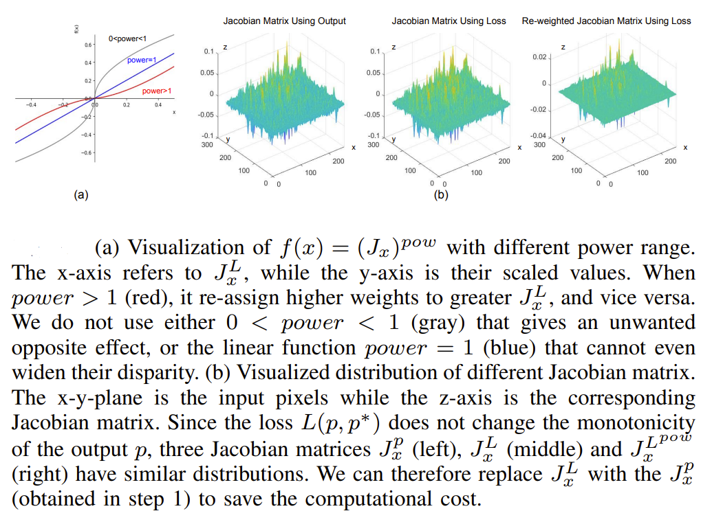

# RADA: Robust Adversarial Data Augmentation for Camera Localization in Challenging Conditions

- [Introduction](#introduction)
- [Installation](#installation)
- [Data Structure](#data-structure)
- [Supported Datasets](#supported-datasets)
    - [7Scenes](#7scenes)
    - [Cambridge Landmarks](#cambridge-landmarks)
- [Training DSAC* with RADA](#training-dsac)
- [Testing DSAC*](#testing-dsac)

## Introduction

This is the PyTorch implementation of **RADA** using DSAC\* model, a simple and efficient adversarial data augmentation approach for improving robustness of camera localization in Challenging Conditions. 

The PyTorch implementation of **RADA** using AtLoc and MapNet models will be published soon.

## Core Algorithm
<p align="center">  </p>

## Installation

This is the PyTorch implementation of **RADA** using DSAC\* model. DSAC\* is based on PyTorch, and includes a custom C++ extension which you have to compile and install (but it's easy). The main framework is implemented in Python, including data processing and setting parameters. The C++ extension encapsulates robust pose optimization and the respective gradient calculation for efficiency reasons.

DSAC\* requires the following python packages, and we tested it with the package versions in brackets

```
pytorch (1.6.0)
opencv (3.4.2)
scikit-image (0.16.2)
```

The repository contains an `environment.yml` for the use with Conda:
```bash
conda env create -f environment.yml
conda activate dsacstar
```

You compile and install the C++ extension by executing:

```bash
cd dsacstar
python setup.py install
```
Compilation requires access to OpenCV header files and libraries. If you are using Conda, the setup script will look for the OpenCV package in the current Conda environment. Otherwise (or if that fails), you have to set the OpenCV library directory and include directory yourself by editing the setup.py file.

If compilation succeeds, you can `import dsacstar` in your python scripts. The extension provides four functions: `dsacstar.forward_rgb(...)`, `dsacstar.backward_rgb(...)`, `dsacstar.forward_rgbd(...)` and `dsacstar.backward_rgbd(...)`. Check our python scripts or the documentation in `dsacstar/dsacstar.cpp` for reference how to use these functions.

**Note:** The code does not support OpenCV 4.x at the moment, due to legacy function calls in the `dsacstar` module. The code can be adjusted for the use with OpenCV 4.x but you might still face compiler compatibility issues when installing OpenCV via Conda. Any prebuilt OpenCV binaries must be compatible to the compiler of your system that compiles the `dsacstar` module. Compiling OpenCV from source on your system should ensure compiler compatibility.

## Data Structure

The `datasets` folder is expected to contain one sub-folder per self-contained scene (e.g. one indoor room or one outdoor area).
We do not provide any data with this repository.
However, the `datasets` folder comes with a selection of Python scripts that will download and setup the datasets used in our paper (linux only, please adapt the script for other operating systems).
In the following, we describe the data format expected in each scene folder, but we advice to look at the provided dataset scripts for reference.

Each sub-folder of `datasets` should be structured by the following sub-folders that implement the training/test split expected by the code:

`datasets/<scene_name>/training/`  
`datasets/<scene_name>/test/`  

Training and test folders contain the following sub-folders:

`rgb/` -- image files  
`calibration/` -- camera calibration files  
`poses/`  -- camera transformation matrix   
`init/` -- (**optional** for training) pre-computed ground truth scene coordinates  
`depth/` -- (**optional** for training) can be used to compute ground truth scene coordinates on the fly  
`eye/`-- (**optional** for RGB-D inputs) pre-computed camera coordinates (i.e. back-projected depth maps)  

Correspondences of files across the different sub-folders will be established by alphabetical ordering.

**Details for image files**: Any format supported by `scikit-image`.

**Details for pose files**: Text files containing the camera pose **h** as 4x4 matrix following the 7Scenes convention. The pose transforms camera coordinates **e** to scene coordinates **y**, i.e. **y** = **he**.

**Details for calibration files**: Text file. At the moment we only support the camera focal length (one value shared for x- and y-direction, in px). The principal point is assumed to lie in the image center.

**Details for init files**: (3xHxW) tensor (standard PyTorch file format via `torch.save`/`torch.load`) where H and W are the dimension of the *output* of our network. Since we rescale input images to 480px height, and our network predicts an output that is sub-sampled by a factor of 8, our init files are 60px height. Invalid scene coordinate values should be set to zeros, e.g. when generating scene coordinate ground truth from a sparse SfM reconstruction. For **reference** how to generate these files, we refer to `datasets/setup_cambridge.py` where they are generated from sparse SfM reconstructions, or `dataset.py` where they are generated from dense depth maps and ground truth poses.

**Details for depth files**: Any format supported by `scikit-image`. Should have same size as the corresponding RGB image and contain a depth measurement per pixel in millimeters. Invalid depth values should be set to zero.

**Details for eye files**: Same format, size and conventions as `init` files but should contain camera coordinates instead of scene coordinates. For **reference** how to generate these files, we refer to `dataset.py` where associated **scene coordinate** tensors are generated from depth maps. Just adapt that code by storing **camera coordinates** directly, instead of transforming them with the ground truth pose.

## Supported Datasets

Prior to using these datasets, please check their orignial licenses (see the website links at the beginning of each section). 

### 7Scenes

[7Scenes (MSR)](https://www.microsoft.com/en-us/research/project/rgb-d-dataset-7-scenes/) is a small-scale indoor re-localization dataset. The authors provide training/test split information, and a dense 3D scan of each scene, RGB and depth images as well as ground truth poses. We provide the Python script `setup_7scenes.py` to download the dataset and convert it into our format.

**Note that the provided depth images are not yet registered to the RGB images, and using them directly will lead to inferior results.** As an alternative, we provide rendered depth maps [here](https://doi.org/10.11588/data/N07HKC/4PLEEJ). Just extract the archive inside `datasets/` and the depth maps should be merged into the respective 7Scenes sub-folders.

For RGB-D experiments we provide pre-computed camera coordinate files (`eye/`) for all training and test scenes [here](https://doi.org/10.11588/data/N07HKC/M15VC5). We generated them from the original depth maps after doing a custom registration to the RGB images. Just extract the archive inside `datasets/` and the coordinate files should be merged into the respective 7Scenes sub-folders.


### Cambridge Landmarks

[Cambridge Landmarks](http://mi.eng.cam.ac.uk/projects/relocalisation/#dataset) is an outdoor re-localization dataset. The dataset comes with a set of RGB images of five landmark buildings in the city of Cambridge (UK). The authors provide training/test split information, and a structure-from-motion (SfM) reconstruction containing a 3D point cloud of each building, and reconstructed camera poses for all images. We provide the Python script `setup_cambridge.py` to download the dataset and convert it into our format. The script will generate ground-truth scene coordinate files from the sparse SfM reconstructions. This dataset is not suitable for RGB-D based pose estimation since measured depth maps are not available. 

*Note: The Cambridge Landmarks dataset contains a sixth scene, *Street*, which we omitted in our experiments due to the poor quality of the SfM reconstruction.*

## Training DSAC*

We train DSAC\* in two stages: Initializing scene coordinate regression, and end-to-end training. DSAC\* supports various variants of camera re-localization, depending on what information about the scene is available at training and test time, e.g. a 3D reconstruction of the scene, or depth measurements for images.

*Note: We will provide pre-trained networks for 7Scenes, and Cambridge very soon. (The GPU of our lab was broken and we lost all the trained models. We are retraining them and will upload soon.)*

You may call all training scripts with the `-h` option to see a listing of all supported command line arguments. The default settings of all parameters correspond to our experiments in the paper. 

Each training script will create a log file `*.txt` file which contains the training iteration and training loss in each line. The initalization script will additionally log the percentage of valid predictions w.r.t. the various constraints described in the paper.

### Initalization

#### RGB only (mode 0)
If only RGB images and ground truth poses are available (minimal setup), initialize a network by calling:

```bash
python train_init.py <scene_name> <network_output_file> --mode 0
```
Mode 0 triggers the RGB only mode which requires no pre-computed ground truth scene coordinates nor depth maps. You specify a scene via `<scene_name>` which should correspond to the sub-directory of the `datasets` folder, e.g. 'Cambridge_GreatCourt'. `<network_output_file>` specifies under which file name the script should store the resulting new network.

#### RGB + 3D Model (mode 1)
When a 3D model of the scene is available, it may be utilized during the initalization stage which usually leads to improved accuracy. You may utilize the 3D model in two ways: Either you use it together with the ground truth poses to render dense depth maps for each RGB image (see `depth\` folder description in the Data Structure section above), as we did for 7Scenes. Note that we provide such rendered depth maps for 7Scenes, see Supported Datasets section above. 

In this case, the training script will generate ground truth scene coordinates from the depth maps and ground truth poses (implemented in `dataset.py`).
```bash
python train_init.py <scene_name> <network_output_file> --mode 1
```

Alternatively, you may pre-compute ground truth scene coordinate files directly (see `init\` folder description in the Data Structure section above), as we did for Cambridge Landmarks. Note that the `datasets\setup_cambridge.py` script will generate these files for you. To utilize pre-computed scene coordinate ground truth, append the `-sparse` flag.

```bash
python train_init.py <scene_name> <network_output_file> --mode 1 -sparse
```

#### RGB-D (mode 2)
When (measured) depth maps for each image are available, you call:
```bash
python train_init.py <scene_name> <network_output_file> --mode 2
```
This uses the `depth\` dataset folder similar to mode 1 to generate ground truth scene coordinates but optimizes a different loss for initalization (3D distance instead of reprojection error).

*Note: The 7Scenes depth maps are not registered to the RGB images, and hence are not directly usable for training. However, in our experiments, we used rendered depth maps for both 7Scenes to initialize scene coordinate regression.* 

### End-To-End Training with RADA

End-To-End training supports two modes: RGB (mode 1) and RGB-D (mode 2) depending on whether depth maps are available or not. 

```bash
python rada_train_hybrid.py <scene_name> <network_input_file> --mode <1 or 2> --weightrot_rada <1.0> --weighttrans_rada <100.0> --softclamp_rada <100.0> --threshold_rada <2> 
```

`<network_input_file>` points to a network which has already been initialized for this scene. 
`<weightrot_rada>` points to the weight of rotation part of pose loss_rada. 
`<weighttrans_rada>` points to the weight of translation part of pose loss_rada. 
`<softclamp_rada>` points to the robust square root loss after this threshold_rada. 
`<threshold_rada>` points to the number of threshold for RADA perturbation, see Paper Section III-B Step 3.

Mode 2 (RGB-D) requires pre-computed camera coordinate files (see Data Structure section above). We provide these files for 7Scenes, see Supported Datasets section.

## Testing DSAC*

Testing supports two modes: RGB (mode 1) and RGB-D (mode 2) depending on whether depth maps are available or not. 

To evaluate on a scene, call:
```bash
python test.py <scene_name> <network_input_file> --mode <1 or 2>
```

This will estimate poses for the test set, and compare them to the respective ground truth.  You specify a scene via `<scene_name>` which should correspond to the sub-directory of the `dataset` folder, e.g. 'Cambridge_GreatCourt'. `<network_input_file>` points to a network which has already been initialized for this scene.
Running the script creates two output files:

`test_<scene_name>_.txt` -- Contains the median rotation error (deg), the median translation error (cm), and the average processing time per test image (s).

`poses_<scene_name>_.txt` -- Contains for each test image the corrsponding file name, the estimated pose as 4D quaternion (wxyz) and 3D translation vector (xyz), followed by the rotation error (deg) and translation error (m).

Mode 2 (RGB-D) requires pre-computed camera coordinate files (see Data Structure section above). We provide these files for 7Scenes, see Supported Datasets section. Note that these files have to be generated from the **measured** depth maps (but ensure proper registration to RGB images). You should not utlize rendered depth maps here, since rendering would use the ground truth camera pose which means that ground truth test information leaks into your input data.

Call the test script with the `-h` option to see a listing of all supported command line arguments. 

## Acknowledgements
Our code partially builds on [DSAC_star](https://github.com/vislearn/dsacstar) and [ART](https://github.com/Trusted-AI/adversarial-robustness-toolbox)
